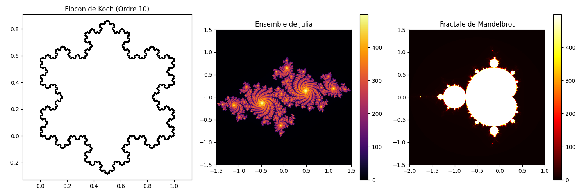
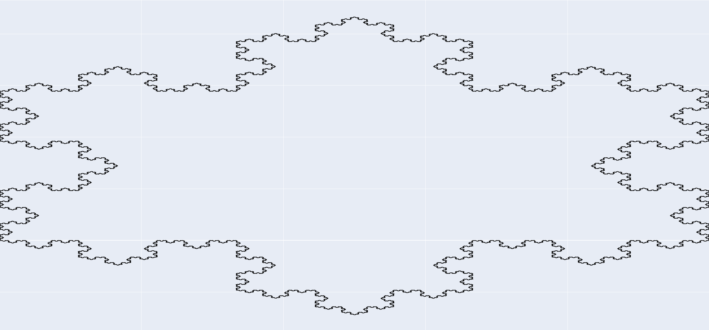
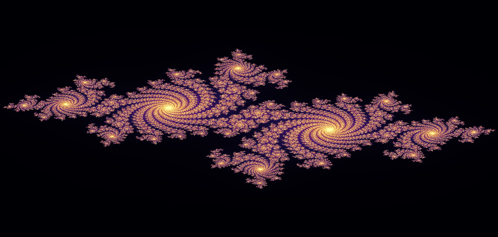
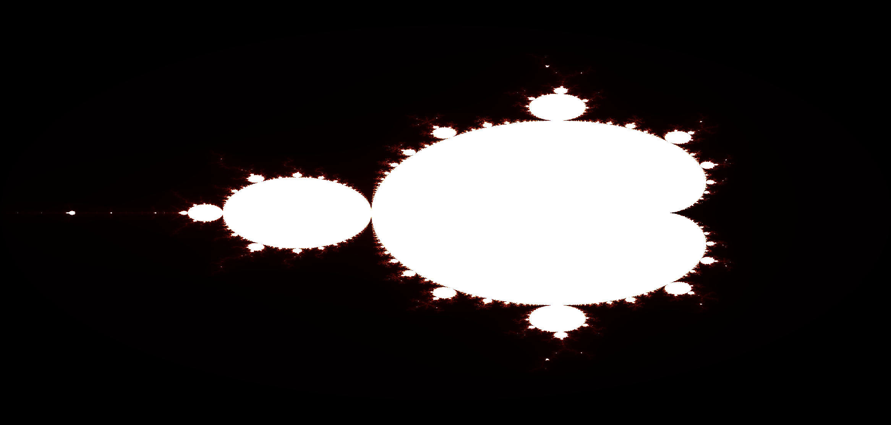

# Visualisation de Fractales : Flocon de Koch, Ensemble de Julia et Ensemble de Mandelbrot

Ce projet visualise trois fractales mathématiques fascinantes : le **Flocon de Koch**, l'**Ensemble de Julia** et l'**Ensemble de Mandelbrot**. Chaque fractale est générée à l'aide de Python et peut être visualisée individuellement ou ensemble dans une vue combinée.

## Table des Matières

- [Aperçu](#aperçu)
- [Fonctionnalités](#fonctionnalités)
- [Prérequis](#prérequis)
- [Installation](#installation)
- [Utilisation](#utilisation)
- [Exemples](#exemples)
- [Licence](#licence)

## Aperçu

Les fractales sont des motifs infiniment complexes qui sont auto-similaires à différentes échelles. Ce projet fournit un moyen interactif d'explorer ces fractales :

1. **Flocon de Koch** : Une fractale géométrique générée récursivement.
2. **Ensemble de Julia** : Un ensemble de nombres complexes qui génèrent de magnifiques motifs.
3. **Ensemble de Mandelbrot** : L'ensemble fractal emblématique représentant des nombres complexes sous itération.

## Fonctionnalités

- Visualisez le **Flocon de Koch** avec une profondeur de récursion personnalisable.
- Générez l'**Ensemble de Julia** pour une constante complexe donnée.
- Rendez l'**Ensemble de Mandelbrot** avec une résolution et des limites d'itération ajustables.
- Affichez toutes les fractales ensemble dans un seul graphique pour les comparer.
- Visualisations interactives utilisant **Plotly** pour chaque fractale.

## Prérequis

Assurez-vous d'avoir les éléments suivants installés :

- Python 3.7 ou supérieur
- Bibliothèques nécessaires (installez-les avec `pip`) :
  - `numpy`
  - `matplotlib`
  - `plotly`

## Installation

1. Clonez le dépôt :
   ```bash
   git clone https://github.com/Luriot/Fractal_Koch_Julia_Mendelbrot.git
   cd Fractal_Koch_Julia_Mendelbrot
   ```

2. Installez les dépendances :
   ```bash
   pip install -r requirements.txt
   ```

## Utilisation

Exécutez le script pour générer et visualiser les fractales :

```bash
python fractal.py
```

### Paramètres

Vous pouvez modifier les paramètres des fractales directement dans le script :

- **Flocon de Koch** :
  - `order` : Profondeur de récursion (par défaut : 10)
- **Ensemble de Julia** :
  - `julia_c` : Constante complexe (par défaut : `-0.7 + 0.27015j`)
  - `julia_resolution` : Résolution de la grille (par défaut : 3000)
  - `julia_iterations` : Itérations maximales (par défaut : 500)
- **Ensemble de Mandelbrot** :
  - `mandelbrot_resolution` : Résolution de la grille (par défaut : 3000)
  - `mandelbrot_iterations` : Itérations maximales (par défaut : 500)

## Exemples

### Vue Combinée

Affiche les trois fractales côte à côte :



### Flocon de Koch

Visualise le Flocon de Koch à la profondeur de récursion spécifiée :



### Ensemble de Julia

Génère l'Ensemble de Julia pour une constante complexe donnée :



### Ensemble de Mandelbrot

Rend l'Ensemble de Mandelbrot avec la résolution et les itérations spécifiées :



## Licence

Ce projet est sous licence MIT. Consultez le fichier [LICENSE](LICENSE) pour plus de détails.
